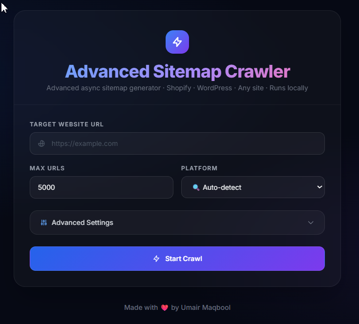
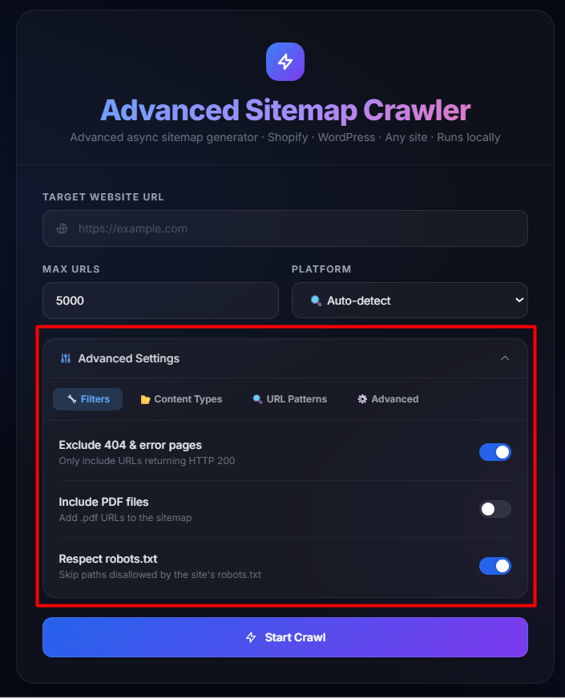
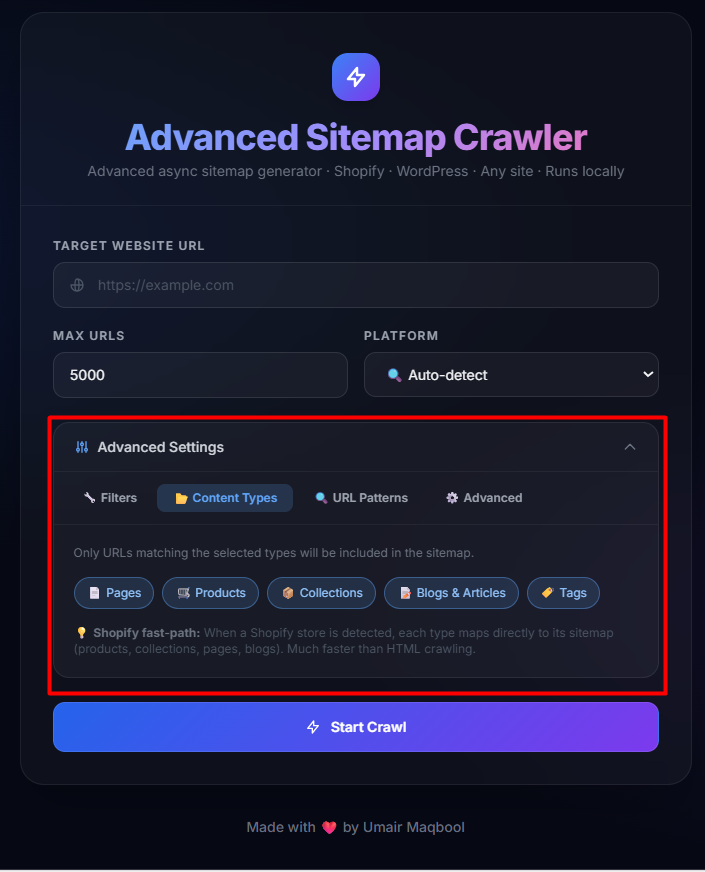
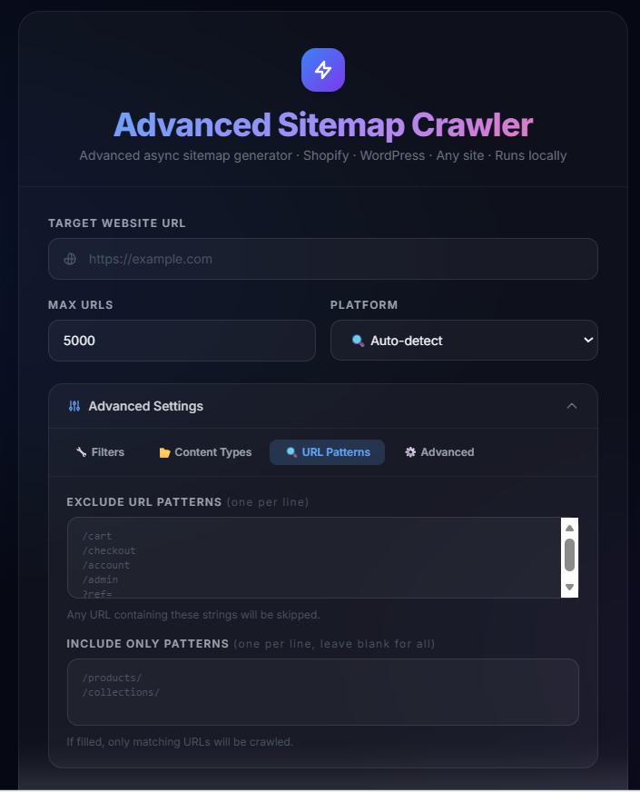
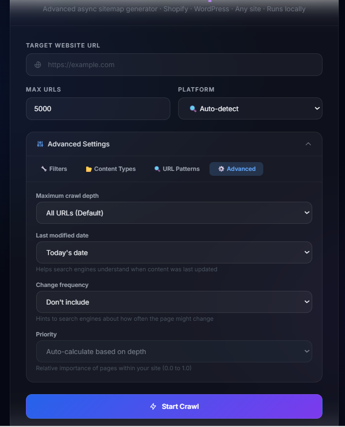
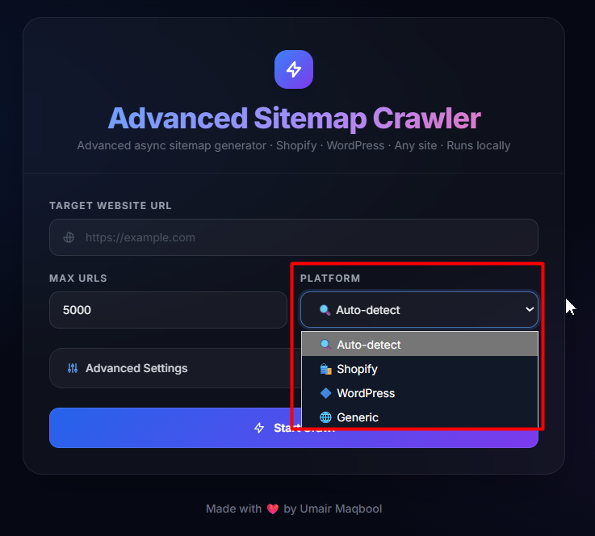
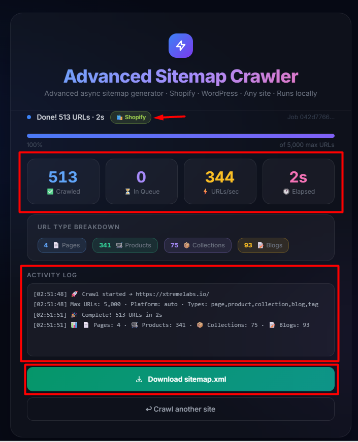

# Advanced Sitemap Crawler

<p align="center">
	Fast async sitemap generation with live progress, platform auto-detection, and advanced crawl controls.
</p>

<p align="center">
	
	
	
	
</p>

<p align="center">
	
</p>

## Why This Project

Advanced Sitemap Crawler helps you generate clean XML sitemaps quickly from a beautiful local interface. It is built for developers, SEO professionals, and ecommerce operators who need practical crawl control without complex setup.

## Key Features

- High-performance async crawling with `aiohttp`
- Live crawl tracking with progress bar, counters, and activity log
- Automatic platform detection: Shopify, WordPress, Generic
- Shopify sitemap fast-path for large stores
- URL type filtering: Pages, Products, Collections, Blogs, Tags
- Advanced filtering: exclude 404s, include PDFs, respect `robots.txt`
- Pattern rules: exclude URL patterns and include-only patterns
- Advanced sitemap options: depth, lastmod, changefreq, priority strategy
- One-click sitemap XML download when crawl completes

## UI Showcase

The screenshots below were used to structure this README around the actual product experience.

### 1) Main Interface

<p>
	
</p>

### 2) Advanced Settings Tabs

<p>
	
</p>

<p>
	
</p>

<p>
	
</p>

<p>
	
</p>

### 3) Platform Selection

<p>
	
</p>

### 4) Crawl Complete State

<p>
	
</p>

## Tech Stack

- Backend: FastAPI, Uvicorn
- Crawling: aiohttp, BeautifulSoup4
- Templating/UI: Jinja2, Tailwind CSS (CDN)
- XML generation: Python XML libraries

## Project Structure

```text
.
|-- crawler.py
|-- main.py
|-- requirements.txt
|-- images/
|   |-- advanced_filters.png
|   |-- content_types.png
|   |-- depth_priorities.png
|   |-- main_ui.png
|   |-- platform_detection_modes.png
|   |-- sitemap_generated.png
|   `-- url_patterns.png
|-- templates/
|   `-- index.html
|-- LICENSE
`-- README.md
```

## Quick Start

### 1) Clone repository

```bash
git clone https://github.com/umairXtreme/Sitemap-Crawler.git
cd Sitemap-Crawler
```

### 2) Create and activate virtual environment

```bash
python -m venv .venv
```

Windows (PowerShell):

```powershell
.\.venv\Scripts\Activate.ps1
```

Linux/macOS:

```bash
source .venv/bin/activate
```

### 3) Install dependencies

```bash
pip install -r requirements.txt
```

### 4) Run server

```bash
python main.py
```

Open: http://127.0.0.1:8000

## How It Works

1. Enter target website URL.
2. Choose crawl options (platform, filters, patterns, sitemap behavior).
3. Start crawl (background job).
4. Watch real-time progress from `/progress/{job_id}`.
5. Download final sitemap XML from `/download/{job_id}`.

## Configuration Reference

| Option | Description |
|---|---|
| `max_urls` | Maximum URLs to crawl (1 to 50,000) |
| `platform` | `auto`, `shopify`, `wordpress`, `generic` |
| `exclude_404` | Keep only valid pages |
| `include_pdfs` | Include `.pdf` URLs |
| `respect_robots` | Respect `robots.txt` disallow paths |
| `exclude_patterns` | Skip URLs containing custom patterns |
| `include_only_patterns` | Crawl only URLs that match patterns |
| `url_types` | Restrict to page/product/collection/blog/tag |
| `max_depth` | Crawl depth limit (`0` = unlimited) |
| `last_modified` | Last modified strategy for XML |
| `changefreq` | Change frequency hint for XML |

## API Endpoints

| Method | Endpoint | Purpose |
|---|---|---|
| `GET` | `/` | Render UI |
| `POST` | `/start-crawl` | Start crawl job |
| `GET` | `/progress/{job_id}` | Fetch live progress |
| `GET` | `/download/{job_id}` | Download sitemap XML |

## Example Use Cases

- Generate XML sitemap for a Shopify store quickly.
- Crawl only product and collection URLs.
- Exclude account/cart/checkout paths from sitemap output.
- Enforce depth limits for large websites.
- Run local SEO audits without third-party tools.

## Performance Notes

- Shopify mode can be significantly faster due to native sitemap parsing.
- Real crawl time depends on site size, server response speed, and filters.
- Some sites may rate-limit or block aggressive crawling.

## License

Released under the MIT License. See [LICENSE](LICENSE).
